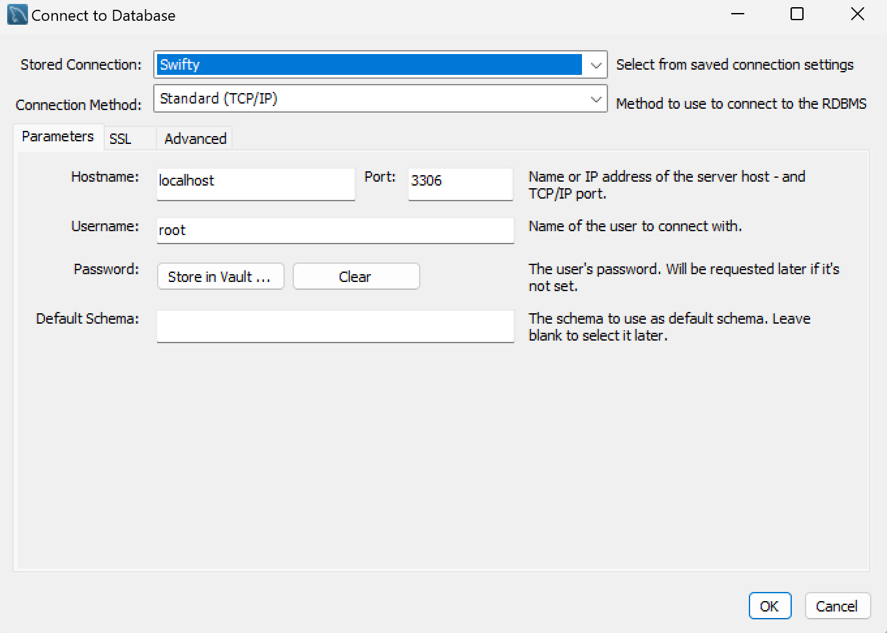
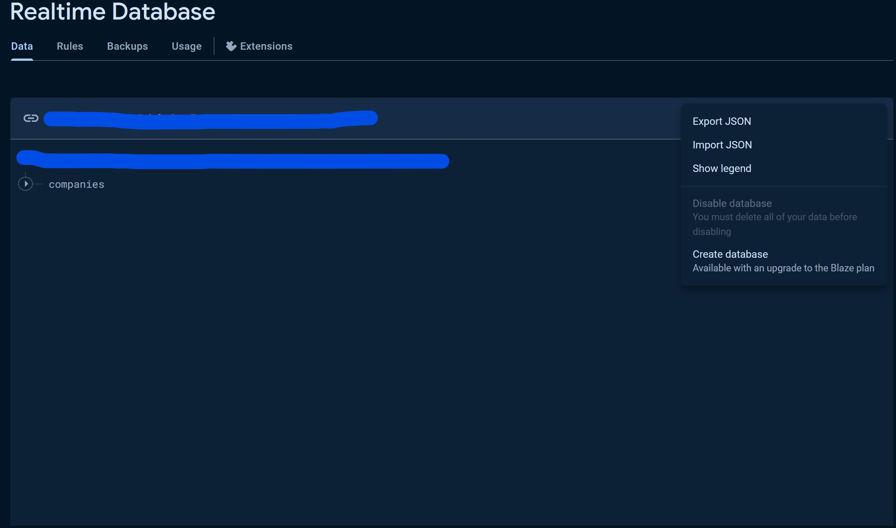

# Swifty-Server

## Table of Contents

- [Description](#description)
- [Setup/Configuration](#setupconfiguration)
    - [MySQL setup](#1set-up-the-mysql-server)
    - [Application properties](#2add-the-username-and-password-to-the-applicationproperties)
    - [Set up RTDB](#3set-up-your-rtdb-database)
    - [Firebase config](#4add-the-firebaseconfig-to-the-applicationproperties)
- [Links](#links)

## Description

This server hosts the Swifty app, an integral component of my thesis project. Built on **Spring Boot** and **MySQL**,
the
project adheres to **RESTful** principles. Additionally, **Firebase Realtime Database (RTDB)** is utilized as a mock to
simulate
API calls for retrieving data from companies.

It's important to note that this project is currently a work in progress, serving as a minimum viable product. Over
time, it will undergo enhancements to bolster its robustness and scalability.

## Setup/Configuration

Here's a step-by-step guide for setting up the MySQL server and configuring your application properties:

#### 1.Set up the MySql server:

  
For detailed instructions, you can refer to
the [MySQL documentation](https://dev.mysql.com/doc/mysql-getting-started/en/).  
Additionally, test data for the database can be
found  [here](https://github.com/PaulLinden/Swifty-Server/blob/main/test-data/db-test-data/store.sql).

#### 2.Add the username and password to the application.properties:

``spring.application.name="Swifty"``  
``spring.jpa.hibernate.ddl-auto=update``  
``spring.datasource.url=jdbc:mysql://${MYSQL_HOST:localhost}:3306/store``   
``spring.datasource.username=root``    
``spring.datasource.password={Your_password}``   
``spring.datasource.driver-class-name=com.mysql.cj.jdbc.Driver``    
``server.port=3000``

#### 3.Set up your [RTDB database](https://firebase.google.com/).

Create a database on Firebase and import the JSON data
from [swifty-rtdb-export.json](https://github.com/PaulLinden/Swifty-Server/blob/main/test-data/db-test-data/company_db.json)
to populate it.

#### 4.Add the Firebase.config to the application.properties:

``firebase.config={your_serviceAccountKey.json.string}``  
``firebase.url={your_firebase_URL}``

#### 5.You're all set!.

With the MySQL server and Firebase RTDB configured and the application properties updated, you're ready to use the
server-application with the Swifty app.

## Links

- [UML](docs/swifty-uml.png)
- [Endpoints](docs/endpoints.md)

## Feel free to reach out if you need further assistance!